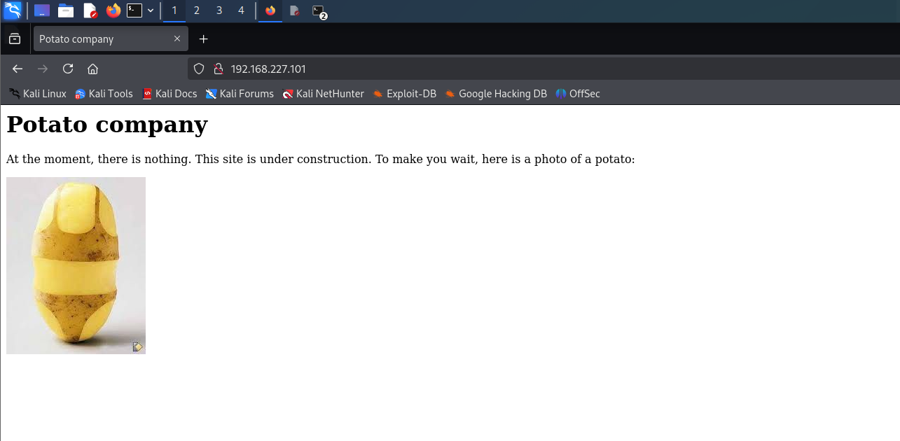
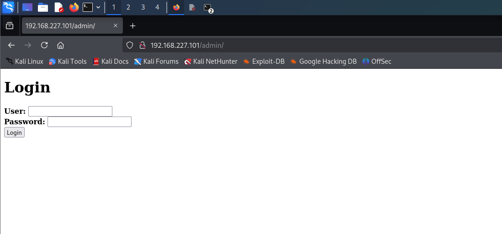

# Potato

First, we conduct an nmap scan:

```
┌──(kali㉿kali)-[~/Desktop/openvpn-files]
└─$ nmap -sS -sV -Pn -p- 192.168.227.101             
Starting Nmap 7.94SVN ( https://nmap.org ) at 2026-07-13 10:07 EDT
Nmap scan report for 192.168.227.101
Host is up (0.081s latency).
Not shown: 65532 closed tcp ports (reset)
PORT     STATE SERVICE VERSION
22/tcp   open  ssh     OpenSSH 8.2p1 Ubuntu 4ubuntu0.1 (Ubuntu Linux; protocol 2.0)
80/tcp   open  http    Apache httpd 2.4.41 ((Ubuntu))
2112/tcp open  ftp     ProFTPD
Service Info: OS: Linux; CPE: cpe:/o:linux:linux_kernel

Service detection performed. Please report any incorrect results at https://nmap.org/submit/ .
Nmap done: 1 IP address (1 host up) scanned in 126.16 seconds
```

We can see an FTP server hosted on port 2112. We can try logging in as an anonymous user:

```
┌──(kali㉿kali)-[~/Desktop/openvpn-files]
└─$ ftp 192.168.227.101 2112
Connected to 192.168.227.101.
220 ProFTPD Server (Debian) [::ffff:192.168.227.101]
Name (192.168.227.101:kali): anonymous
331 Anonymous login ok, send your complete email address as your password
Password: 
230-Welcome, archive user anonymous@192.168.45.174 !
230-
230-The local time is: Mon Jul 13 14:13:48 2026
230-
230 Anonymous access granted, restrictions apply
Remote system type is UNIX.
Using binary mode to transfer files.
ftp> ls
229 Entering Extended Passive Mode (|||15348|)
150 Opening ASCII mode data connection for file list
-rw-r--r--   1 ftp      ftp           901 Aug  2  2020 index.php.bak
-rw-r--r--   1 ftp      ftp            54 Aug  2  2020 welcome.msg
226 Transfer complete
ftp>
```

We can see that logon suceeded, and now we can download files located on the server. As first, we download "index.php.bak" file:

```
ftp> get index.php.bak
local: index.php.bak remote: index.php.bak
229 Entering Extended Passive Mode (|||27801|)
150 Opening BINARY mode data connection for index.php.bak (901 bytes)
   901        4.59 MiB/s 
226 Transfer complete
901 bytes received in 00:00 (10.74 KiB/s)
ftp> 
```

After downloading the file, we open it and we are presented with an hardcoded password:

```
┌──(kali㉿kali)-[~/Desktop/openvpn-files]
└─$ cat index.php.bak 
<html>
<head></head>
<body>

<?php

$pass= "potato"; //note Change this password regularly

...
...
...
```

We are leaving that for later - now we head to the webpage hosted on port 80:



We see nothing interesting so far, so we conduct directory bruteforcing using the `gobuster` tool:

```
┌──(kali㉿kali)-[~/Desktop/openvpn-files]
└─$ gobuster dir -u "http://192.168.227.101/" -w /usr/share/wordlists/dirb/big.txt 
===============================================================
Gobuster v3.6
by OJ Reeves (@TheColonial) & Christian Mehlmauer (@firefart)
===============================================================
[+] Url:                     http://192.168.227.101/
[+] Method:                  GET
[+] Threads:                 10
[+] Wordlist:                /usr/share/wordlists/dirb/big.txt
[+] Negative Status codes:   404
[+] User Agent:              gobuster/3.6
[+] Timeout:                 10s
===============================================================
Starting gobuster in directory enumeration mode
===============================================================
/.htaccess            (Status: 403) [Size: 280]
/.htpasswd            (Status: 403) [Size: 280]
/admin                (Status: 301) [Size: 318] [--> http://192.168.227.101/admin/]
/server-status        (Status: 403) [Size: 280]
Progress: 20469 / 20470 (100.00%)
===============================================================
Finished
===============================================================
```

We can see an login panel at `/admin`:



The "potato" password hardcoded in the `index.php.bak` file happens to be outdated, but we can see another angle for the login panel exploitation. 